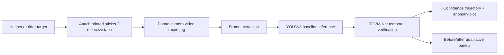

# Small-Scale Physical-World Validation Protocol

This protocol is designed to add limited but useful physical evidence without retraining or changing the paper claims. It can be executed quickly with a printed sticker, reflective tape, a phone camera, and the existing TCVM-Net inference scripts.

## Objective

Measure whether real printed reflective and sticker perturbations produce temporal confidence drops, disappearance events, or anomaly spikes similar to the software reflective probe.

## Materials

- Printed reflective-pattern patch on glossy paper or reflective tape.
- Printed sticker perturbation using the existing patch/sticker image patterns.
- Helmet or helmet-like object.
- Phone camera recording at 30 FPS or 60 FPS.
- Tripod or stable phone mount.
- Outdoor daylight and indoor low-light scenes if available.
- Existing YOLOv8n checkpoint and TCVM scripts.

## Setup Diagram

## Recording Procedure

1. Record a 20-30 second clean video of the helmet target moving slowly across the frame.
2. Record a matched sticker video with the printed sticker attached near the helmet region.
3. Record a matched reflective video with reflective tape or glossy reflective patch attached near the helmet region.
4. Keep camera viewpoint, distance, and lighting as similar as possible across clean and attacked videos.
5. Extract frames at stride 3 or stride 5 to match the current stress-test protocol.
6. Run YOLOv8 baseline inference on all videos.
7. Run TCVM-Net with the same threshold settings used in the paper: `theta = 0.45`, plus sensitivity settings `0.30` and `0.62`.
8. Generate temporal confidence and anomaly plots for clean, sticker, and reflective clips.

## Evaluation Procedure

Report:

- Number of frames.
- Number of YOLO detections per frame.
- Mean detector confidence before and during perturbation.
- Minimum confidence during perturbation.
- Number of disappearance events.
- Maximum TCVM anomaly score.
- Frame-level anomaly precision/recall if manual attack-window labels are available.
- Qualitative before/after panels.

## Reporting Template

| Clip | Frames | Perturbation | Mean clean confidence | Mean attacked confidence | Max anomaly | Recovered frames | Notes |
|---|---:|---|---:|---:|---:|---:|---|
| clean_phone_01 |  | none |  |  |  |  |  |
| sticker_phone_01 |  | printed sticker |  |  |  |  |  |
| reflective_phone_01 |  | reflective tape |  |  |  |  |  |

## Paper-Compatible Claim Language

Use restrained language:

> A small-scale printed perturbation sanity check showed whether the same temporal indicators observed in simulation also appear in phone-camera video. The experiment is not a replacement for a large physical benchmark, but it helps validate the mechanism under real capture noise.

Avoid:

- "Real-world robustness is proven."
- "The defense generalizes to all physical attacks."
- "Physical attacks are solved."

## Expected Artifacts

- `outputs/physical_validation/clean_phone/`
- `outputs/physical_validation/sticker_phone/`
- `outputs/physical_validation/reflective_phone/`
- `outputs/figures/physical_confidence_clean_vs_attack.pdf`
- `outputs/figures/physical_validation_gallery.pdf`
